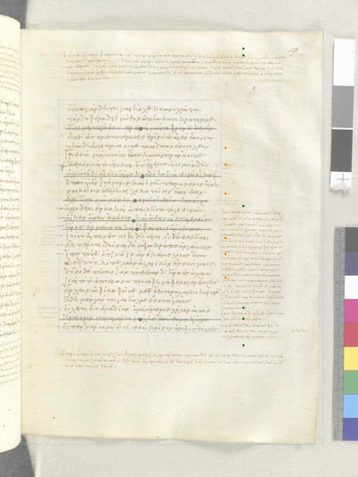

# MiseEnPage.jl

> ☛ *Analyze the layout of manuscript pages edited following the conventions of the Homer Multitext project*.

Interactive Pluto notebook: optimizing placement of *scholia* under the proximity hypothesis:

Results of anlaysis, Venetus A, folio 195 *recto*: theoretical `y` position under the proximity hypothesis versus actual `y` positions:

## Acknowledgments

This package draws heavily on Dennis Ryan's work in the summer of 2023 in collaboration with Neel Smith. Dennis' work is available in [his `MSPageLayout` package](https://github.com/dwryan25/MSPageLayout.jl). We thank the Weiss Summer Research program at Holy Cross for funding Dennis' work.
